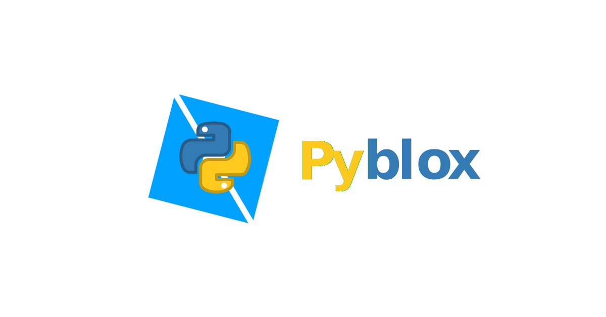

# Overview

<div align="center">
    
</div>

Welcome to pyblox!
pyblox is an asynchronous, object-oriented wrapper for the Roblox web API.  

## Features
The key features are:  

- **Asynchronous**: pyblox works well with asynchronous frameworks like [FastAPI](https://fastapi.tiangolo.com/) and 
[discord.py](https://github.com/Rapptz/discord.py).  
- **Easy**: pyblox's client-based model is intuitive and easy to learn for both the beginner and expert developer. It
  abstracts away API requests and leaves you with simple objects that represent data types on the Roblox platform.
- **Flexible**: pyblox's builtin Requests object allows the user to do things that we haven't already implemented
ourselves without dealing with advanced Roblox-specific concepts.

## Installation
To install pyblox from PyPI, you can install with pip:
```
pip install pyblox
```

To install pyblox from git, run the following:
```
pip install https://github.com/invalidkaro/pyblox
```
